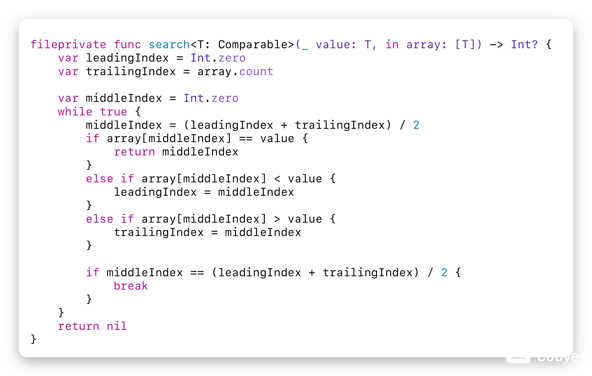
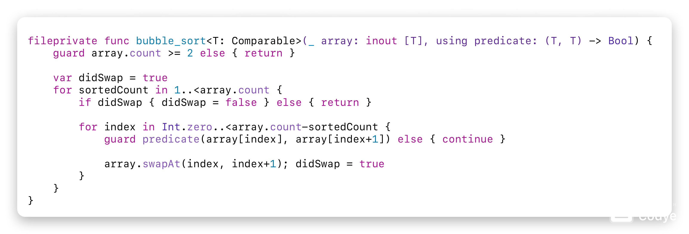
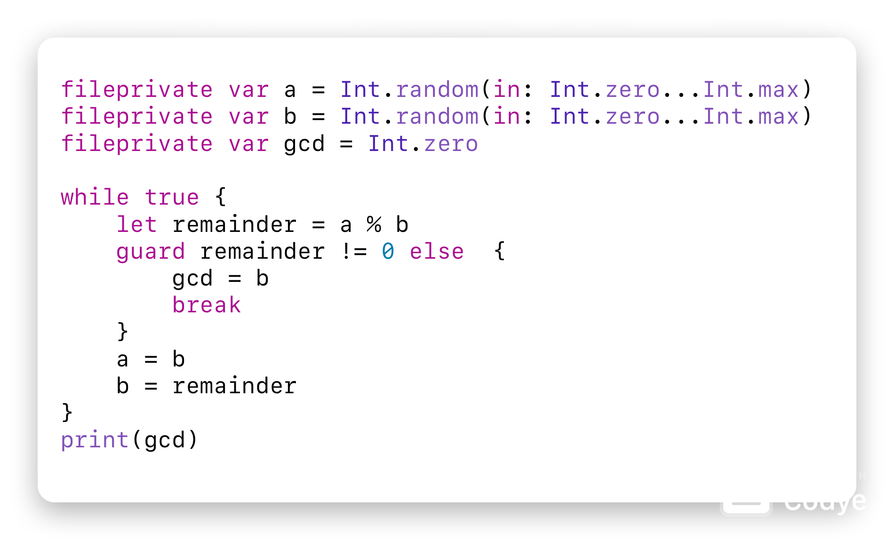
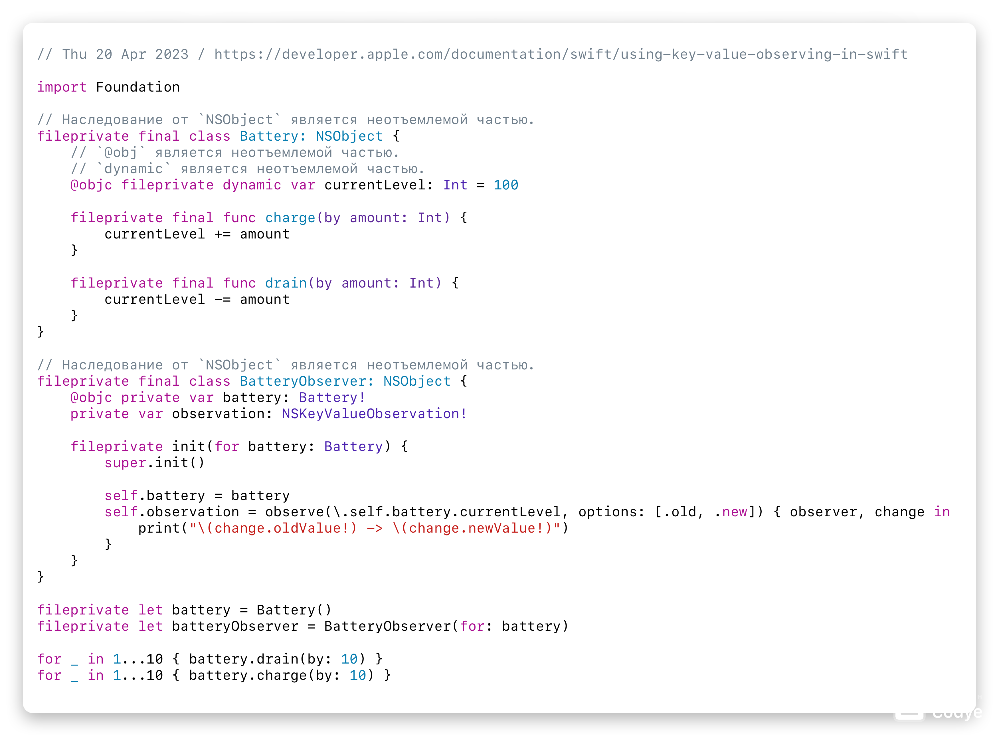
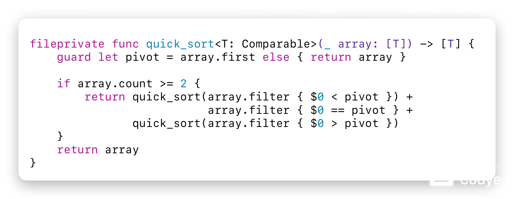
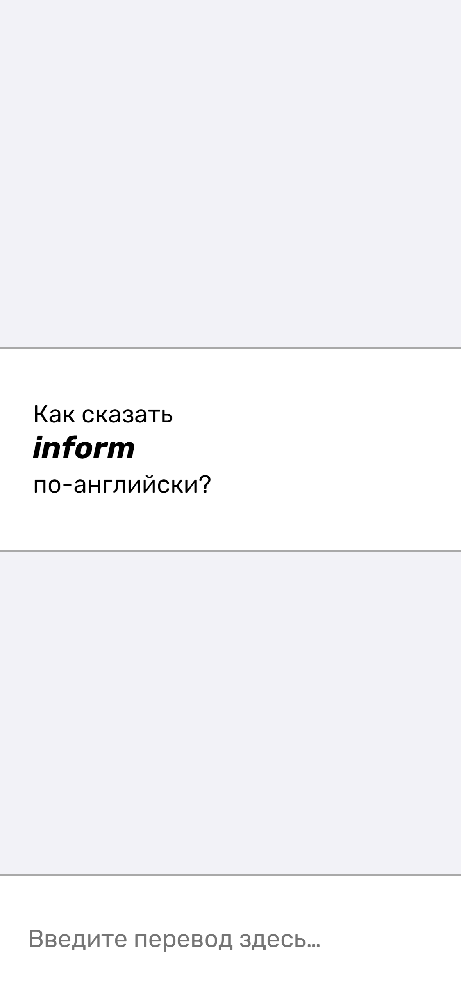
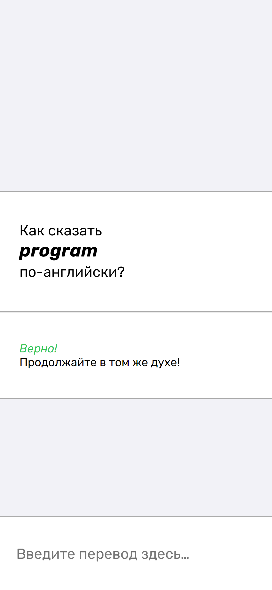
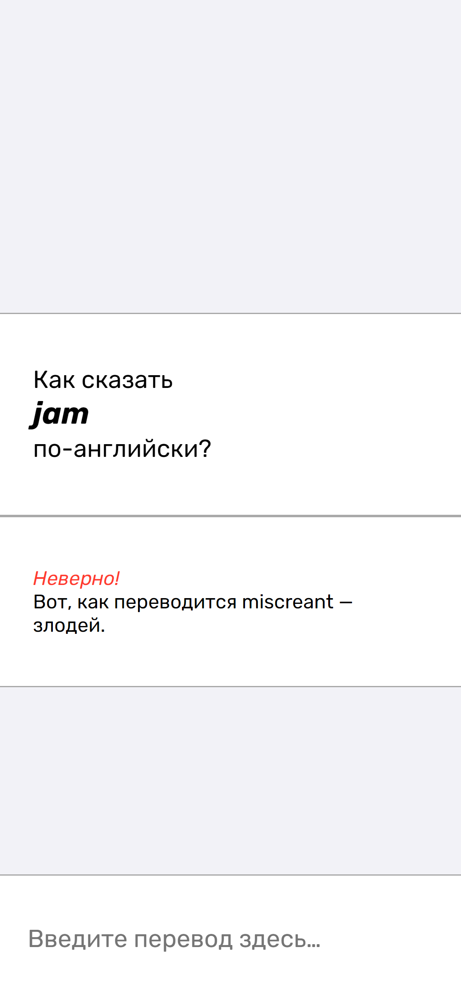
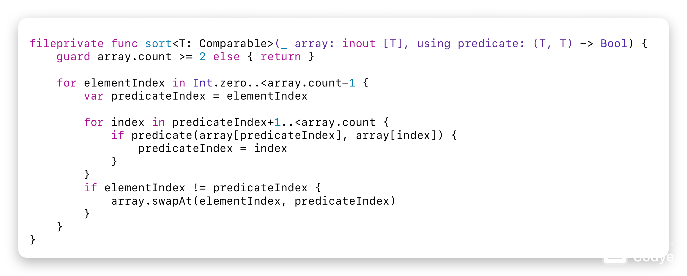
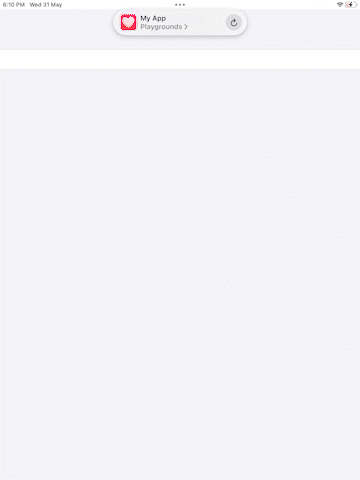

# Vladimir's Swift Playgrounds
## Table of Contents
1. [Alphabet](https://github.com/VladimirCreator/Swift-Playgrounds#alphabet)
2. [Binary Search](https://github.com/VladimirCreator/Swift-Playgrounds#binary-search)
3. [Bubble Sort](https://github.com/VladimirCreator/Swift-Playgrounds#bubble-sort)
4. [Delegate](https://github.com/VladimirCreator/Swift-Playgrounds#delegate)
5. [Euclidean Algorithm](https://github.com/VladimirCreator/Swift-Playgrounds#euclidean-algorithm)
6. [GitHub Explorer](https://github.com/VladimirCreator/Swift-Playgrounds#github-explorer)
7. [KVO](https://github.com/VladimirCreator/Swift-Playgrounds#kvo)
8. [Quick Sort](https://github.com/VladimirCreator/Swift-Playgrounds#quick-sort)
9. [Quiz](https://github.com/VladimirCreator/Swift-Playgrounds#quiz)
10. [Reverse Polish Notation](https://github.com/VladimirCreator/Swift-Playgrounds#reverse-polish-notation)
11. [Selection Sort](https://github.com/VladimirCreator/Swift-Playgrounds#selection-sort)
12. [Shade Explorer](https://github.com/VladimirCreator/Swift-Playgrounds#shade-explorer)
13. [Text2Binary](https://github.com/VladimirCreator/Swift-Playgrounds#text2binary)
14. [Тестовое задание №0](https://github.com/VladimirCreator/Swift-Playgrounds#%D1%82%D0%B5%D1%81%D1%82%D0%BE%D0%B2%D0%BE%D0%B5-%D0%B7%D0%B0%D0%B4%D0%B0%D0%BD%D0%B8%D0%B5-0)
15. [Тестовое задание №1]()

## Alphabet
A tool to sort a list of words in alphabetical order.

### Files
1. [`./swift/alphabet/alphabet.swift`](./swift/alphabet/alphabet.swift)
2. [`./swift/alphabet/UIAlphabetViewController.swift`](./swift/alphabet/UIAlphabetViewController.swift)

### Example

## Binary Search
A tool for searching an item in a collection.

### Files
1. [`./swift/binary_search.swift`](./swift/binary_search.swift)

### Example

## Bubble Sort
An algorithm for sorting a collection.

### Files
1. [`./swift/bubble_sort.swift`](./swift/bubble_sort.swift)

### Example

## Delegate
`nil`

### Files
`nil`

### Example

## Euclidean Algorithm
### Files
1. [`./swift/euclidean_algorithm.swift`](./swift/euclidean_algorithm.swift)

### Example

## GitHub Explorer
A tool for viewing repositories on GitHub.

### Files
`nil`

### Example

## KVO
`nil`

### Files
1. [`./swift/kvo.swift`](./swift/kvo.swift)

### Example

## Quick Sort
An algorithm for sorting collections.

### Files
1. [`./swift/quick_sort.swift`](./swift/quick_sort.swift)

### Example

## Quiz
`nil`

### Files
`nil`

### Quick Look

## Reverse Polish Notation
A tool for solving expressions.

### Files
1. [`./swift/reverse_polish_notation.swift`](./swift/reverse_polish_notation.swift)

### Example

## Selection Sort
A tool for sorting collections.

### Files
1. [`./swift/selection_sort.swift`](./swift/selection_sort.swift)

### Example

## Shade Explorer
A game.

### Files
`nil`

### Example

## Text2Binary
A tool for converting texts to binaries.

### Files
1. [`./swift/text2binary.swift`](./swift/text2binary.swift)
2. [`./swift/UIText2BinaryViewController.swift`](./swift/UIText2BinaryViewController.swift)

### Example

## Тестовое задание №0
Описание.

### Files
1. [`./html_css_js/тестовое_задание_0/index.html`](./html_css_js/тестовое_задание_0/index.html)

### Quick Look

## Тестовое задание №1
Описание.

### Files
1. [`./html_css_js/тестовое_задание_1/`](./html_css_js/тестовое_задание_1/)

### Quick Look

