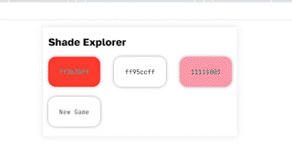

# Vladimir's Swift Playgrounds

## Changelog
> ### Sat 8 Jul 2023 8:10 PM\
> Rename from Swift-Playgrounds to Playgrounds

## Table of Contents
4. [Delegate](https://github.com/VladimirCreator/Swift-Playgrounds#delegate)
6. [GitHub Explorer](https://github.com/VladimirCreator/Swift-Playgrounds#github-explorer)
9. [Quiz](https://github.com/VladimirCreator/Swift-Playgrounds#quiz)
10. [Reverse Polish Notation](https://github.com/VladimirCreator/Swift-Playgrounds#reverse-polish-notation)
12. [Shade Explorer](https://github.com/VladimirCreator/Swift-Playgrounds#shade-explorer)
14. [Тестовое задание №0](https://github.com/VladimirCreator/Swift-Playgrounds#%D1%82%D0%B5%D1%81%D1%82%D0%BE%D0%B2%D0%BE%D0%B5-%D0%B7%D0%B0%D0%B4%D0%B0%D0%BD%D0%B8%D0%B5-0)
15. [Тестовое задание №1](https://github.com/VladimirCreator/Swift-Playgrounds/tree/%D1%82%D0%B5%D1%81%D1%82%D0%BE%D0%B2%D0%BE%D0%B5-%D0%B7%D0%B0%D0%B4%D0%B0%D0%BD%D0%B8%D0%B5-1#%D1%82%D0%B5%D1%81%D1%82%D0%BE%D0%B2%D0%BE%D0%B5-%D0%B7%D0%B0%D0%B4%D0%B0%D0%BD%D0%B8%D0%B5-1)

## Delegate
`nil`

### Files
`nil`

### Example

## GitHub Explorer
A tool for viewing repositories on GitHub.

### Files
`nil`

### Example

## Quiz
`nil`

### Files
`nil`

### Quick Look

## Reverse Polish Notation
A tool for solving expressions.

### Files
1. [`./swift/reverse_polish_notation.swift`](./swift/reverse_polish_notation.swift)

### Example

## Shade Explorer
A game.

### Files
`nil`

### Example

## Тестовое задание №0
Описание.

### Files
1. [`./html_css_js/тестовое_задание_0/index.html`](./html_css_js/тестовое_задание_0/index.html)

### Quick Look

## Тестовое задание №1
Описание.

### Files
1. [`./html_css_js/тестовое_задание_1/package.json`](./html_css_js/тестовое_задание_1/package.json)
2. [`./html_css_js/тестовое_задание_1/package-lock.json`](./html_css_js/тестовое_задание_1/package-lock.json)
3. [`./html_css_js/тестовое_задание_1/tailwind.config.js`](./html_css_js/тестовое_задание_1/tailwind.config.js)
4. [`./html_css_js/тестовое_задание_1/src/index.css`](./html_css_js/тестовое_задание_1/src/index.css)
5. [`./html_css_js/тестовое_задание_1/src/index.js`](./html_css_js/тестовое_задание_1/src/index.js)
6. [`./html_css_js/тестовое_задание_1/src/components/App/App.css`](./html_css_js/тестовое_задание_1/src/components/App/App.css)
7. [`./html_css_js/тестовое_задание_1/src/components/App/App.js`](./html_css_js/тестовое_задание_1/src/components/App/App.js)
8. [`./html_css_js/тестовое_задание_1/src/components/Letter/Letter.js`](./html_css_js/тестовое_задание_1/src/components/Letter/Letter.js)
9. [`./html_css_js/тестовое_задание_1/src/components/Letter/LetterAside.js`](./html_css_js/тестовое_задание_1/src/components/Letter/LetterAside.js)
10. [`./html_css_js/тестовое_задание_1/src/components/Letter/LetterAttachment.js`](./html_css_js/тестовое_задание_1/src/components/Letter/LetterAttachment.js)
11. [`./html_css_js/тестовое_задание_1/src/components/Letter/LetterContent.js`](./html_css_js/тестовое_задание_1/src/components/Letter/LetterContent.js)
12. [`./html_css_js/тестовое_задание_1/src/components/Letter/LetterFooter.js`](./html_css_js/тестовое_задание_1/src/components/Letter/LetterFooter.js)
13. [`./html_css_js/тестовое_задание_1/src/components/Letter/LetterHeader.js`](./html_css_js/тестовое_задание_1/src/components/Letter/LetterHeader.js)
14. [`./html_css_js/тестовое_задание_1/src/components/LetterList/LetterList.js`](./html_css_js/тестовое_задание_1/src/components/LetterList/LetterList.js)
15. [`./html_css_js/тестовое_задание_1/src/redux/store.js`](./html_css_js/тестовое_задание_1/src/redux/store.js)
16. [`./html_css_js/тестовое_задание_1/src/redux/slices/applicationSlice.js`](./html_css_js/тестовое_задание_1/src/redux/slices/applicationSlice.js)
17. [`./html_css_js/тестовое_задание_1/public/index.html`](./html_css_js/тестовое_задание_1/public/index.html)
18. [`./html_css_js/тестовое_задание_1/public/manifest.json`](./html_css_js/тестовое_задание_1/public/manifest.json)
19. [`./html_css_js/тестовое_задание_1/public/robots.txt`](./html_css_js/тестовое_задание_1/public/robots.txt)

### Quick Look

