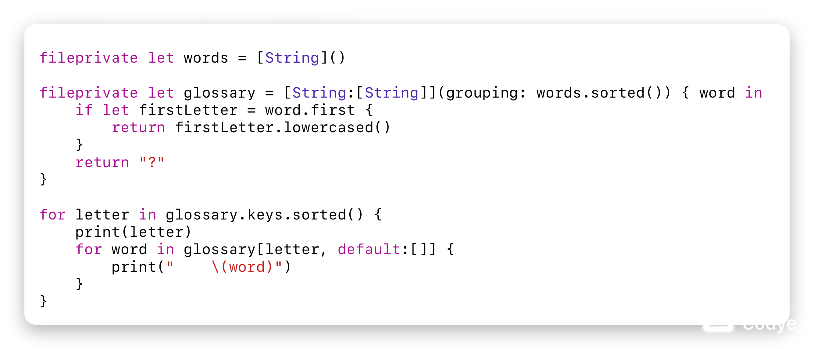
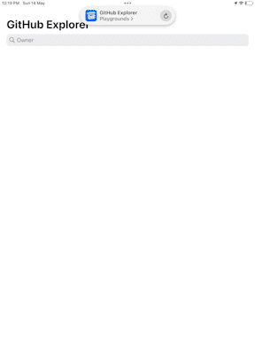
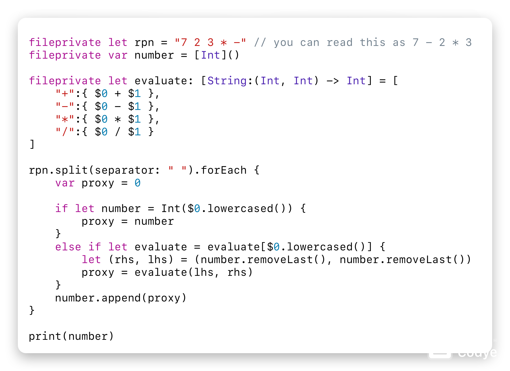

# Vladimir's Swift Playgrounds
## Table of Contents
1. Alphabet
2. GitHub Explorer
3. Reminders
4. Reverse Polish Notation

## Alphabet
A tool to sort a list of words in alphabetical order.

### Files
1. [`.swift//alphabet.swift`](./swift/alphabet.swift)

### Example

## GitHub Explorer
A tool for viewing repositories on GitHub.

### Files
`nil`

### Example

## Reminders
A tool for being productive.

### Files
1. [`./swift/reminders/reminder.swift`](./swift/reminders/reminder.swift)
2. [`./swift/reminders/UIReminderTableViewController.swift`](./swift/reminders/UIReminderTableViewController.swift)
3. [`./swift/reminders/UIReminderTableViewControllerDelegate.swift`](./swift/reminders/UIReminderTableViewControllerDelegate.swift)

### Example

## Reverse Polish Notation
A tool for solving expressions.

### Files
1. [`./swift/reverse_polish_notation.swift`](./swift/reverse_polish_notation.swift)

### Example

