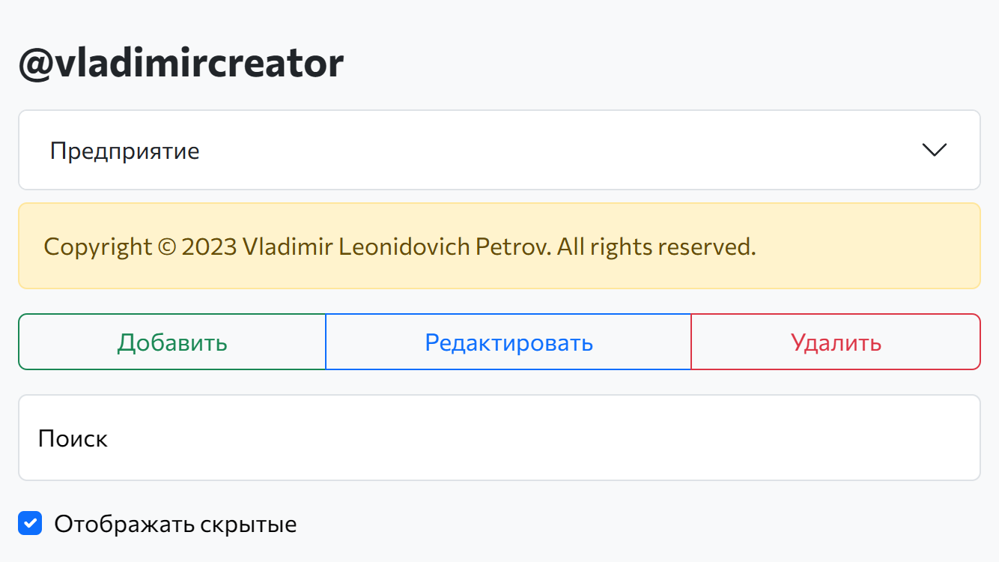
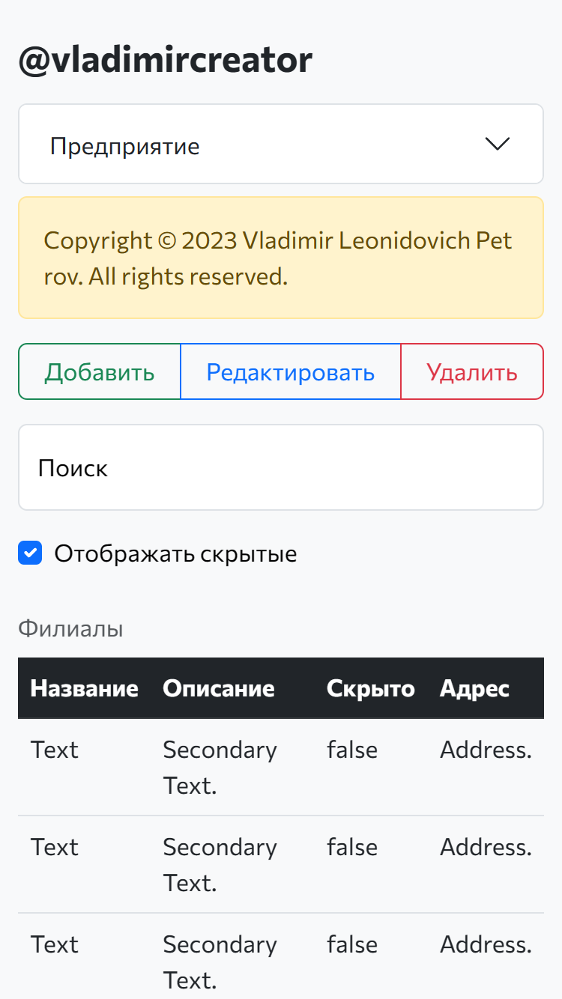
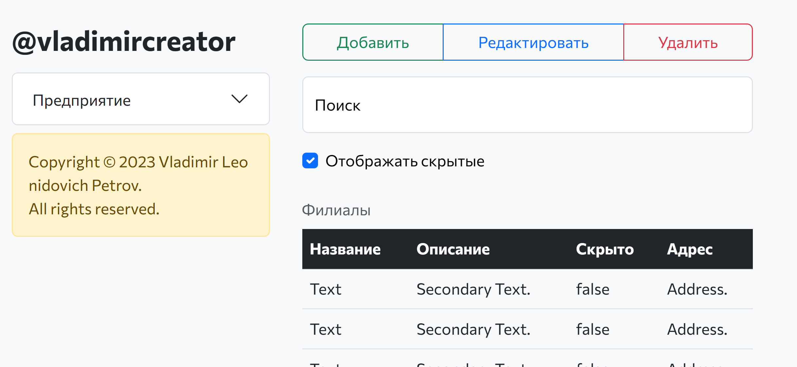

# Vladimir’s Packages

## GitHub Actions

## Table of Contents
There are 0 - 4 items.

1. [Overview](#overview)
1. [Description](#description)
1. [\_R\__ for a Comment](#_r__-for-a-comment)
1. [\_R\__ for a Hotel](#_r__-for-a-hotel)
1. [CRUD for a X](#crud-for-a-x)
1. [CRU_ for an Application](#cru_-for-an-application)
1. [Just a Card](#just-a-card)
1. [Just a Form](#just-a-form)
1. [Shade Explorer](#shade-explorer)
1. [X](#x)
1. [Changelog](#changelog)
1. [License](#license)

## Overview
|№|  |JavaScript|TypeScript|Swift|
|-:|:-|:--------:|:--------:|:---:|
|1|\_R\__ for a Comment|✔️| | |
|2|\_R\__ for a Hotel| | |✔️|
|3|CRUD for a X|✔️| | |
|4|CRU_ for an Application|✔️| | |
|5|Just a Card| |✔️| |
|6|Just a Form| |✔️| |
|7|Shade Explorer|✔️| | |
|8|X| |✔️| |

## Description
A collection of packages where I practice git, GitHub, TypeScript, Swift and so on.

## \_R\__ for a Comment
[Give it a shot](https://vladimircreator.github.io/gists/_r__-for-a-comment/).

### Dependencies
- TypeScript;
- React;
- Redux Toolkit;
- Tailwind CSS.

Запуск сопровождается POST-запросом к серверу, который возвращает список сообщений, где каждое сообщение включает в себя ① уникальный идентификатор, ② дату публикации, ③ автора, ④ содержимое и ⑤ список вложений[^1].

> Ответственность за этот запрос берёт на себя стандартная функция `useEffect`.

Далее, тот же самый запрос отправляется каждые 5 секунд.

> Ответственность за повторные запросы берёт на себя отдельный `useEffect`.

---

Есть возможность интерактивного взаимодействия, а именно:

- пометка сообщения как избранного;

> сообщение, которое было помечено как избранное остаётся таким даже после того, как происходит перезагрузка страницы

- в случае, когда текстовое содержимое сообщения является слишком длинным, появляется кнопка "Далее", которая позволяет отобразить всё текстовое содержимое, а на месте нажатой кнопки появляется кнопка "Скрыть" и наооборот.

> длинное текстовое содержимое считается длинным, когда занимает более 3-ёх строк.

- можно выбрать тег "новое" или "эксперт", но они ничего не делают
- загрузка старых сообщений при нажатии кнопки "Загрузить старые сообщения"
- сортировка списка сообщений "от новых к старым" или "от старых к новым"

### Quick Look

## \_R\__ for a Hotel

## CRUD for a X
[Give it a shot](https://vladimircreator.github.io/gists/crud-for-a-x/).

### Example

#### Desktop Landscape

#### iPhone 6 Landscape

#### iPhone 6 Portrait

#### iPhone X Landscape

#### iPhone X Portrait

## CRU_ for an Application

[Give it a shot](https://vladimircreator.github.io/gists/cru_-for-an-application/).

Запуск сопровождается POST-запросом к серверу, который возвращает список приложений, где у каждого приложения есть ① идентификатор, ② название, ③ идентификатор политики, ④ поле `agent_js_config` и ⑤ поле `correlations_config`.

Есть возможность интерактивного взаимодействия, а именно:
- отправка нового приложения на сервер;
- изменение существующего приложения на сервере.

### Quick Look

## Just a Card
[Take a look](https://vladimircreator.github.io/gists/just-a-card/).

## Just a Form
[Give it a shot](https://vladimircreator.github.io/gists/just-a-form/).

## Shade Explorer
[Give it a shot](https://vladimircreator.github.io/gists/shade-explorer/).

### Quick Look

## X
[Give it a shot](https://vladimircreator.github.io/gists/X/).

## Changelog

### Sat 8 Jul 2023 8:10 PM
Rename this repository from Swift-Playgrounds to Playgrounds.

### Sun 5 Nov 2023 9:27 PM
Rename this repository from Playgrounds to gists.

### Sun 10 Nov 2023 8:03 AM
Rename this repository from gists to Packages.

## License
See [License](LICENSE).

[^1]: Данный список состоит из фотографий и видео.
