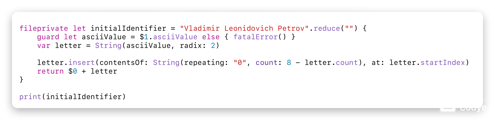

# Vladimir's Swift Playgrounds
## Table of Contents
1. Alphabet
2. GitHub Explorer
3. KVO
4. Quick Sort
5. Reverse Polish Notation
6. Text2Binary

## Alphabet
A tool to sort a list of words in alphabetical order.

### Files
1. [`./alphabet.swift`](./alphabet.swift)

### Example

## GitHub Explorer
A tool for viewing repositories on GitHub.

### Files
`nil`

### Example

## KVO
`nil`

### Files
1. [`./kvo.swift`](./kvo.swift)

### Example

## Quick Sort
An algorithm for sorting collections.

### Files
1. [`./swift/quick_sort.swift`](./swift/quick_sort.swift)

### Example

## Reverse Polish Notation
A tool for solving expressions.

### Files
1. [`./reverse_polish_notation.swift`](./reverse_polish_notation.swift)

### Example

## Text2Binary
A tool for converting texts to binaries.

### Files
1. [`./text2binary.swift`](./text2binary.swift)

### Example

